## DBProject

## Database Mini Project  

**Submitted by:** Hila Chaimov, Talya Yakov  
**System:** Attractions and Tourism  
**Selected Unit:** Review System  


---


# Table of Contents

1. [Introduction](#introduction)
2. [System Screens Designed with AI](#system-screens-designed-with-ai)
3. [Link to AI Studio](#link-to-ai-studio)
4. [ERD Diagram](#erd-diagram)
5. [DSD Diagram](#dsd-diagram)
6. [Design Decisions](#design-decisions)
7. [Data Insertion Methods](#data-insertion-methods)
8. [Backup and Restore](#backup-and-restore)
9. [Stage B – Queries and Constraints](#stage-b--queries-and-constraints)
10. [Stage C – Integration and Views](#stage-c--integration-and-views)
11. [Stage D – PL/pgSQL Programming](#stage-d--plpgsql-programming)
12. [Stage E - Graphical Application](#stage-e---graphical-application-submission-option-2)
13. [Summary](#summary)


---


# Introduction

This project presents a database design for an **Attractions and Tourism** system, focusing on a **Review System**.

The purpose of the system is to manage reviews written by customers about tourist attractions and to support interactions around these reviews.  
The system stores information about customers, attractions, tickets, reviews, reactions to reviews, and reports submitted on reviews.

The main functionality of the system includes:
- managing customers and their registration details
- storing attractions and their categories
- managing tickets purchased for attractions
- allowing customers to write reviews for purchased attractions
- allowing customers to react to reviews
- allowing customers to report reviews when needed

The system was designed in a **top-down approach**, as required in the project instructions: first, we designed the screens using Google AI Studio, and then we derived the database structure and relationships from the screens and the required functionality. 


---


# System Screens Designed with AI

In the first stage of the project, we designed the system screens using **Google AI Studio**.  
These screens helped us understand the user flow and define the database entities and relationships.


---


# Link to AI Studio

[Open the AI Studio App](https://ai.studio/apps/1da9ab35-02f4-4f42-80d1-14f1e5014ec7)


---


# ERD Diagram

The following ERD describes the main entities in the system and the relationships between them.


---


# DSD Diagram

The following DSD presents the relational schema generated from the ERD design.


---


# Design Decisions

During the design process, we made several important decisions:

## 1. Separation into Main Functional Entities

We divided the system into several core entities:
- **Customer** – stores customer personal and registration details
- **Attraction** – stores information about attractions
- **Ticket** – stores ticket purchase and visit information
- **Review** – stores customer reviews on attractions
- **ReviewReaction** – stores reactions to reviews
- **ReviewReport** – stores reports submitted about reviews

This separation makes the database clearer, reduces redundancy, and supports normalization.

## 2. Review System Based on Actual Visits

The system connects reviews to tickets, which helps represent a more realistic logic: reviews are related to actual attraction visits and not just random submissions.

## 3. Support for User Interaction

We added separate entities for:
- **ReviewReaction**
- **ReviewReport**

This allows the system not only to store reviews, but also to support customer interaction and moderation processes.

## 4. Use of Meaningful Date Attributes

The database includes several important date fields, such as:
- `purchase_date`
- `visit_date`
- `review_date`
- `reaction_date`
- `report_date`
- `decision_date`
- `deleted_date`
- `register_date`

Using multiple meaningful date attributes follows the project requirement and also supports future queries and system tracking. 

## 5. Normalization Considerations

The schema was designed to support at least **3NF**, in order to reduce duplication and preserve consistency between customers, attractions, tickets, reviews, and reports.

## 6. Optional Fields

Some fields were intentionally defined as optional, such as:
- attraction description
- review title
- deleted date
- report description
- admin decision
- decision date

This allows more flexibility in real system usage.


---


# Data Insertion Methods

According to the project requirements, data was inserted using three different methods: Python-generated CSV files, manual SQL insertion, and Mockaroo-generated data.

## Method 1 – CSV Files Generated by Python Script

In this method, a Python script was used to generate CSV files containing data for the database tables.

### Description

This method is useful for generating a large amount of structured data efficiently and preparing it for import into the database.

### Screenshot


### Relevant Files

- `DataImportFiles/generate_csv_data.py`
- `DataImportFiles/customer.csv`
- `DataImportFiles/attraction.csv`
- `DataImportFiles/ticket.csv`
- `DataImportFiles/review.csv`
- `DataImportFiles/reviewreaction.csv`
- `DataImportFiles/reviewreport.csv`
- `DataImportFiles/import_from_csv.sql`

---


## Method 2 – Manual Insertion

In this method, data was inserted manually using SQL `INSERT` statements.

### Description

This method is useful for testing the schema, verifying constraints, and inserting initial sample records.

### Screenshot


### Relevant Files

- `insertTables.sql`


---


## Method 3 – Mockaroo

### Screenshot


### Relevant Files

- `DataImportFiles/atraction2.csv`

---


# Backup and Restore

## Backup


A backup of the database was created and saved as:
- `backup_2026-04-14.backup`

## Restore


The restore process was performed using the backup file in order to verify that the database can be recovered successfully.


---

# Stage B – Queries and Constraints

## Introduction

In this stage, we queried the database using non-trivial `SQL` queries, added constraints and indexes, and demonstrated the use of transactions with `ROLLBACK` and `COMMIT`.

The queries were written to match the future GUI screens of the system and to provide meaningful information based on multiple related tables, as required in the project instructions.

This stage includes:
- 8 `SELECT` queries
- 3 `UPDATE` queries
- 3 `DELETE` queries
- 3 new constraints
- 3 indexes
- `ROLLBACK` and `COMMIT` demonstrations


---


## SELECT Queries

### SELECT 1A – Tickets with Customer and Attraction Details using `JOIN`

#### Description

This query displays tickets together with the details of the customer who purchased them and the attraction for which the ticket was bought.  
Its purpose is to provide a complete purchase view in one screen.

#### SQL Code

```sql
SELECT
    t.ticket_id,
    t.purchase_date,
    t.visit_date,
    t.price,
    t.ticket_status,
    c.customer_id,
    c.full_name,
    c.email,
    a.attraction_id,
    a.attraction_name,
    a.city,
    a.category
FROM TICKET t
JOIN CUSTOMER c ON t.customer_id = c.customer_id
JOIN ATTRACTION a ON t.attraction_id = a.attraction_id
ORDER BY t.purchase_date DESC, t.ticket_id;
```


#### Run and Result Screenshot


---

### SELECT 1B – Tickets with Customer and Attraction Details using `SUBQUERY`

#### Query Description

This query returns the same information as the previous query, but instead of using `JOIN`, it uses subqueries in order to retrieve customer and attraction details.

#### SQL Code

```sql
SELECT
    t.ticket_id,
    t.purchase_date,
    t.visit_date,
    t.price,
    t.ticket_status,
    t.customer_id,
    (SELECT c.full_name
     FROM CUSTOMER c
     WHERE c.customer_id = t.customer_id) AS full_name,
    (SELECT c.email
     FROM CUSTOMER c
     WHERE c.customer_id = t.customer_id) AS email,
    t.attraction_id,
    (SELECT a.attraction_name
     FROM ATTRACTION a
     WHERE a.attraction_id = t.attraction_id) AS attraction_name,
    (SELECT a.city
     FROM ATTRACTION a
     WHERE a.attraction_id = t.attraction_id) AS city,
    (SELECT a.category
     FROM ATTRACTION a
     WHERE a.attraction_id = t.attraction_id) AS category
FROM TICKET t
ORDER BY t.purchase_date DESC, t.ticket_id;
```


#### Run and Result Screenshot


#### Comparison and Efficiency

Both queries return the same information.

However, the JOIN version is usually more efficient because the database engine performs a direct join between the relevant tables.
In the SUBQUERY version, repeated lookups may be performed for each row, which can make it less efficient on larger datasets.
Therefore, SELECT 1A is considered more efficient and also easier to read.


---

### SELECT 2A – Reviews with Customer and Attraction Details using `JOIN`

#### Query Description

This query displays reviews written in the system, together with the details of the customer who wrote the review and the details of the attraction the review refers to.

To retrieve this information, the query goes through the `TICKET` table, because the review is linked to a ticket, and the ticket is linked both to the customer and to the attraction.

#### SQL Code

```sql
SELECT
    r.review_id,
    r.title,
    r.rating,
    r.content,
    r.review_date,
    r.is_deleted,
    c.customer_id,
    c.full_name,
    a.attraction_id,
    a.attraction_name,
    a.city,
    t.ticket_id
FROM REVIEW r
JOIN TICKET t ON r.ticket_id = t.ticket_id
JOIN CUSTOMER c ON t.customer_id = c.customer_id
JOIN ATTRACTION a ON t.attraction_id = a.attraction_id
ORDER BY r.review_date DESC, r.review_id;
```


#### Run and Result Screenshot


---

### SELECT 2B – Reviews with Customer and Attraction Details using `SUBQUERY`

#### Query Description

This query returns the same information as the previous query, but instead of using `JOIN`, it uses subqueries to retrieve the customer name and attraction name.

#### SQL Code

```sql
SELECT
    r.review_id,
    r.title,
    r.rating,
    r.content,
    r.review_date,
    r.is_deleted,
    r.ticket_id,

    (SELECT c.full_name
     FROM CUSTOMER c
     JOIN TICKET t ON c.customer_id = t.customer_id
     WHERE t.ticket_id = r.ticket_id) AS full_name,

    (SELECT a.attraction_name
     FROM ATTRACTION a
     JOIN TICKET t ON a.attraction_id = t.attraction_id
     WHERE t.ticket_id = r.ticket_id) AS attraction_name,

    (SELECT a.city
     FROM ATTRACTION a
     JOIN TICKET t ON a.attraction_id = t.attraction_id
     WHERE t.ticket_id = r.ticket_id) AS city

FROM REVIEW r
WHERE EXISTS (
    SELECT 1
    FROM TICKET t
    JOIN CUSTOMER c ON t.customer_id = c.customer_id
    JOIN ATTRACTION a ON t.attraction_id = a.attraction_id
    WHERE t.ticket_id = r.ticket_id
)
ORDER BY r.review_date DESC, r.review_id;
```


#### Run and Result Screenshot


#### Comparison and Efficiency

Here as well, both queries return the same information, but in different ways.  
In the `JOIN` version, the data is retrieved through direct joins between the relevant tables, so it is usually more efficient and easier to understand.  
In the `SUBQUERY` version, subqueries are used for each row, and therefore on larger datasets this approach may be less efficient.  
For this reason, `SELECT 2A` is considered preferable in terms of efficiency and readability.


---

### SELECT 3A – Counting Reactions per Review using `LEFT JOIN` and `GROUP BY`

#### Query Description

This query displays, for each review, the total number of reactions, as well as how many reactions are of type `like` and how many are of type `dislike`.

The purpose of this query is to analyze the level of user engagement for each review.

#### SQL Code

```sql
SELECT
    r.review_id,
    r.title,
    r.rating,
    r.review_date,
    COUNT(rr.reaction_id) AS total_reactions,
    COUNT(CASE WHEN rr.reaction_type = 'like' THEN 1 END) AS likes_count,
    COUNT(CASE WHEN rr.reaction_type = 'dislike' THEN 1 END) AS dislikes_count
FROM REVIEW r
LEFT JOIN REVIEWREACTION rr ON r.review_id = rr.review_id
GROUP BY r.review_id, r.title, r.rating, r.review_date
ORDER BY total_reactions DESC, r.review_id;
```


#### Run and Result Screenshot


---

### SELECT 3B – Counting Reactions per Review using `SUBQUERY`

#### Query Description

This query returns the same information as the previous query, but performs the counting by using separate subqueries for each review.

#### SQL Code

```sql
SELECT
    r.review_id,
    r.title,
    r.rating,
    r.review_date,
    (SELECT COUNT(*)
     FROM REVIEWREACTION rr
     WHERE rr.review_id = r.review_id) AS total_reactions,
    (SELECT COUNT(*)
     FROM REVIEWREACTION rr
     WHERE rr.review_id = r.review_id
       AND rr.reaction_type = 'like') AS likes_count,
    (SELECT COUNT(*)
     FROM REVIEWREACTION rr
     WHERE rr.review_id = r.review_id
       AND rr.reaction_type = 'dislike') AS dislikes_count
FROM REVIEW r
ORDER BY total_reactions DESC, r.review_id;
```


#### Run and Result Screenshot


#### Comparison and Efficiency

In `SELECT 3A`, a `LEFT JOIN` was performed between reviews and reactions, followed by `GROUP BY` and aggregation.  
In `SELECT 3B`, several subqueries were executed separately for each review.  
Usually, the `JOIN + GROUP BY` approach is more efficient, because it allows the database engine to process the data in a more centralized way.  
In contrast, with subqueries, each review may require multiple additional scans of the `REVIEWREACTION` table, so it is usually less efficient on larger datasets.


---

### SELECT 4A – Reviews Reported at Least Once using `EXISTS`

#### Query Description

This query displays reviews that were reported at least once, together with the customer details and attraction details related to the review.

Its purpose is to display content that requires administrative review.

#### SQL Code

```sql
SELECT
    r.review_id,
    r.title,
    r.rating,
    r.review_date,
    t.ticket_id,
    a.attraction_name,
    c.full_name
FROM REVIEW r
JOIN TICKET t ON r.ticket_id = t.ticket_id
JOIN ATTRACTION a ON t.attraction_id = a.attraction_id
JOIN CUSTOMER c ON t.customer_id = c.customer_id
WHERE EXISTS (
    SELECT 1
    FROM REVIEWREPORT rep
    WHERE rep.review_id = r.review_id
)
ORDER BY r.review_date DESC, r.review_id;
```


#### Run and Result Screenshot


---

### SELECT 4B – Reviews Reported at Least Once using `IN`

#### Query Description

This query returns the same reported reviews, but instead of `EXISTS` it uses `IN` to check whether the review ID appears in the reports table.

#### SQL Code

```sql
SELECT
    r.review_id,
    r.title,
    r.rating,
    r.review_date,
    t.ticket_id,
    a.attraction_name,
    c.full_name
FROM REVIEW r
JOIN TICKET t ON r.ticket_id = t.ticket_id
JOIN ATTRACTION a ON t.attraction_id = a.attraction_id
JOIN CUSTOMER c ON t.customer_id = c.customer_id
WHERE r.review_id IN (
    SELECT rep.review_id
    FROM REVIEWREPORT rep
)
ORDER BY r.review_date DESC, r.review_id;
```


#### Run and Result Screenshot


#### Comparison and Efficiency

In the first version we used `EXISTS`, and in the second version we used `IN`.  
When the purpose is only to check whether a matching row exists in another table, `EXISTS` is often considered more efficient, because the database engine can stop as soon as a match is found.  
In contrast, `IN` checks whether the value belongs to the set returned by the subquery, and this may be less efficient when the dataset is large.  
Therefore, in this case the `EXISTS` solution is considered preferable.


---

### SELECT 5 – Ticket Purchases by Year and Month

#### Query Description

This query summarizes ticket purchases in the system by year and month of the purchase date.

It shows how many tickets were purchased in each period, the total revenue, and the average ticket price.

This query is suitable for a managerial sales analysis screen.

#### SQL Code

```sql
SELECT
    EXTRACT(YEAR FROM t.purchase_date) AS purchase_year,
    EXTRACT(MONTH FROM t.purchase_date) AS purchase_month,
    COUNT(*) AS tickets_count,
    SUM(t.price) AS total_revenue,
    ROUND(AVG(t.price), 2) AS avg_ticket_price
FROM TICKET t
GROUP BY
    EXTRACT(YEAR FROM t.purchase_date),
    EXTRACT(MONTH FROM t.purchase_date)
ORDER BY purchase_year DESC, purchase_month DESC;
```


#### Run and Result Screenshot


---

### SELECT 6 – Attraction Ranking by Average Reviews and Number of Reviews

#### Query Description

This query ranks attractions in the system by their average rating and by the number of reviews written about them.

In addition, it displays the minimum and maximum rating for each attraction.

This query is suitable for a screen showing top attractions.

#### SQL Code

```sql
SELECT
    a.attraction_id,
    a.attraction_name,
    a.city,
    a.category,
    COUNT(r.review_id) AS reviews_count,
    ROUND(AVG(r.rating), 2) AS avg_rating,
    MIN(r.rating) AS min_rating,
    MAX(r.rating) AS max_rating
FROM ATTRACTION a
JOIN TICKET t ON a.attraction_id = t.attraction_id
JOIN REVIEW r ON t.ticket_id = r.ticket_id
GROUP BY a.attraction_id, a.attraction_name, a.city, a.category
ORDER BY avg_rating DESC, reviews_count DESC, a.attraction_id;
```


#### Run and Result Screenshot


---

### SELECT 7 – Customers Who Wrote the Most Reviews

#### Query Description

This query displays the most active customers in the system in terms of writing reviews.

For each customer, it shows the number of reviews written, the average rating they gave, and the date of their latest review.

This query is suitable for a managerial user activity analysis screen.

#### SQL Code

```sql
SELECT
    c.customer_id,
    c.full_name,
    c.email,
    COUNT(r.review_id) AS reviews_written,
    ROUND(AVG(r.rating), 2) AS avg_given_rating,
    MAX(r.review_date) AS last_review_date
FROM CUSTOMER c
JOIN TICKET t ON c.customer_id = t.customer_id
JOIN REVIEW r ON t.ticket_id = r.ticket_id
GROUP BY c.customer_id, c.full_name, c.email
ORDER BY reviews_written DESC, last_review_date DESC, c.customer_id;
```


#### Run and Result Screenshot


---

### SELECT 8 – Reports by Reason and by Month

#### Query Description

This query displays reports submitted on reviews, grouped by report reason, year, and month.

In addition, it shows how many reports already received an admin decision and how many are still pending.

This query is suitable for an administrative moderation screen.

#### SQL Code

```sql
SELECT
    rep.report_reason,
    EXTRACT(YEAR FROM rep.report_date) AS report_year,
    EXTRACT(MONTH FROM rep.report_date) AS report_month,
    COUNT(*) AS reports_count,
    COUNT(CASE WHEN rep.admin_decision IS NOT NULL THEN 1 END) AS decided_reports,
    COUNT(CASE WHEN rep.admin_decision IS NULL THEN 1 END) AS pending_reports
FROM REVIEWREPORT rep
GROUP BY
    rep.report_reason,
    EXTRACT(YEAR FROM rep.report_date),
    EXTRACT(MONTH FROM rep.report_date)
ORDER BY report_year DESC, report_month DESC, reports_count DESC;
```


#### Run and Result Screenshot


## UPDATE Queries

### UPDATE 1 – Update Ticket Status

### Query Description

This query updates the status of one specific ticket to `used`.

Its purpose is to demonstrate updating ticket information in the system and to simulate a real case in which a purchased ticket is marked as used.

```sql
-- Before

SELECT *
FROM TICKET
WHERE ticket_id = 150;
```


```sql
-- Update

UPDATE TICKET
SET ticket_status = 'used'
WHERE ticket_id = 150;
```


### After Screenshot


### UPDATE 2 – Update Admin Decision in Review Report

### Query Description

This query updates one specific report by setting an admin decision and a decision date.

Its purpose is to simulate an administrative moderation action in the review report system.

#### Before

```sql
SELECT *
FROM REVIEWREPORT
WHERE report_id = 2;
```


#### Update

```sql
UPDATE REVIEWREPORT
SET admin_decision = 'approved',
    decision_date = CURRENT_DATE
WHERE report_id = 2;
```


### After Screenshot


### UPDATE 3 – Mark Review as Deleted

### Query Description

This query updates one specific review by marking it as deleted and setting its deletion date.

Its purpose is to simulate a moderation process in which a review is hidden from the system.

```sql
-- Before

SELECT *
FROM REVIEW
WHERE review_id = 1;
```


#### Update

```sql
UPDATE REVIEW
SET is_deleted = TRUE,
    deleted_date = CURRENT_DATE
WHERE review_id = 1;
```


### After Screenshot


## DELETE Queries

### DELETE 1 – Delete One Review Reaction

### Query Description

This query deletes one specific reaction from the REVIEWREACTION table.

Its purpose is to demonstrate deleting a dependent record from the database.

#### Before

```sql
SELECT *
FROM REVIEWREACTION
WHERE reaction_id = 15;
```


### Delete

```sql
DELETE FROM REVIEWREACTION
WHERE reaction_id = 15;
```


#### After


### DELETE 2 – Delete One Review Report

### Query Description

This query deletes one specific record from the REVIEWREPORT table.

Its purpose is to demonstrate deleting a moderation report from the system.

#### Before

```sql
SELECT *
FROM REVIEWREPORT
WHERE report_id = 20;
```


#### Delete

```sql
DELETE FROM REVIEWREPORT
WHERE report_id = 20;
```


#### After


### DELETE 3 – Delete One Review with No Reactions and No Reports

### Query Description

This query deletes one specific review that has no related reactions and no related reports.

Its purpose is to safely demonstrate deletion of a review without violating foreign key constraints.

#### Before

```sql
SELECT *
FROM REVIEW
WHERE review_id = 25;
```


#### Delete

```sql
DELETE FROM REVIEW
WHERE review_id = 25;
```


#### After


---


---


## Constraints

In this part, we added three new constraints to the database using `ALTER TABLE`, in order to improve data consistency and enforce business rules in the system.

For each constraint, we:
- added the constraint using `ALTER TABLE`
- attempted to insert invalid data that violates the constraint
- verified that the database returned an error


---


### Constraint 1 – Valid Ticket Status Values

### Description

This constraint was added to the `TICKET` table in order to allow only valid values for `ticket_status`.

Its purpose is to prevent invalid status values from being inserted into the system and to ensure data consistency.

```sql
ALTER TABLE TICKET
ADD CONSTRAINT chk_ticket_status
CHECK (ticket_status IN ('active', 'used', 'cancelled'));
```

#### Invalid Insert Test

```sql
INSERT INTO TICKET
(ticket_id, purchase_date, visit_date, price, ticket_status, customer_id, attraction_id)
VALUES
(
    401,
    CURRENT_DATE,
    CURRENT_DATE + INTERVAL '7 days',
    100.00,
    'invalid_status',
    1,
    1
);
```


### Constraint 2 – Review Deletion Logic

### Description

This constraint was added to the REVIEW table in order to enforce consistency between is_deleted and deleted_date.

Its purpose is to prevent invalid combinations such as a review marked as not deleted while still having a deletion date.

```sql
ALTER TABLE REVIEW
ADD CONSTRAINT chk_review_deleted_logic
CHECK (
    (is_deleted = FALSE AND deleted_date IS NULL)
    OR
    (is_deleted = TRUE AND deleted_date IS NOT NULL)
);
```

### Invalid Insert Test

```sql
INSERT INTO REVIEW
(review_id, rating, title, content, review_date, is_deleted, deleted_date, ticket_id)
VALUES
(
    402,
    4,
    'Invalid Review',
    'This insert should fail because the deletion fields are inconsistent.',
    CURRENT_DATE,
    FALSE,
    CURRENT_DATE,
    1
);
```


### Constraint 3 – Admin Decision Requires Decision Date

### Description

This constraint was added to the REVIEWREPORT table in order to ensure that when an admin decision exists, a decision date must also exist.

Its purpose is to maintain consistency in the moderation process.

```sql
ALTER TABLE REVIEWREPORT
ADD CONSTRAINT chk_reviewreport_decision_date
CHECK (
    (admin_decision IS NULL AND decision_date IS NULL)
    OR
    (admin_decision IS NOT NULL AND decision_date IS NOT NULL)
);
```

### Invalid Insert Test

```sql
INSERT INTO REVIEWREPORT
(report_id, report_reason, report_description, report_date, admin_decision, decision_date, customer_id, review_id)
VALUES
(
    403,
    'spam',
    'This insert should fail because admin_decision exists without decision_date.',
    CURRENT_DATE,
    'approved',
    NULL,
    1,
    1
);
```


---


## ROLLBACK and COMMIT Demonstration

In this part, we demonstrated the use of transactions in the database.

We showed two different cases:
- one case in which an update was performed and then cancelled using `ROLLBACK`
- one case in which an update was performed and then permanently saved using `COMMIT`

These examples demonstrate how transactions can control whether changes remain in the database or are undone.


---


### ROLLBACK Demonstration – Mark Review as Deleted and Cancel the Change

### Description

In this example, we updated one review by marking it as deleted and setting a deletion date.

After verifying that the change was applied, we used `ROLLBACK` and showed that the database returned to its previous state.

```sql
BEGIN;

-- Before

SELECT *
FROM REVIEW
WHERE review_id = 2;
```


```sql
-- Update

UPDATE REVIEW
SET is_deleted = TRUE,
    deleted_date = CURRENT_DATE
WHERE review_id = 2;
```
#### After Update


#### Rollback

```sql
ROLLBACK;
```

#### After Rollback


### COMMIT Demonstration – Update Admin Decision and Save the Change

### Description

In this example, we updated one review report by setting an admin decision and a decision date.

After verifying that the change was applied, we used COMMIT and showed that the updated values remained in the database.

```sql
BEGIN;

-- Before

SELECT *
FROM REVIEWREPORT
WHERE report_id = 35;
```


#### Update

```sql
UPDATE REVIEWREPORT
SET admin_decision = 'rejected',
    decision_date = CURRENT_DATE
WHERE report_id = 35;
```

#### After Update


#### Commit

```sql
COMMIT;
```

#### After Commit


The final screenshot shows that after executing COMMIT, the updated values still remain in the database. This proves that the transaction was permanently saved.


---


## Indexes

In this part, we added three indexes to the database and tested query performance before and after adding each index.

The purpose of these indexes is to improve query performance on columns that are frequently used in joins or filtering conditions.

For each index, we:
- ran a query with `EXPLAIN ANALYZE` before adding the index
- created the index
- ran the same query again with `EXPLAIN ANALYZE`
- compared the execution times and explained the result


---


### Index 1 – Index on `TICKET(customer_id)`

### Description

This index was added on the `customer_id` column in the `TICKET` table.

Its purpose is to improve the performance of queries that join customers with their tickets.

```sql
EXPLAIN ANALYZE
SELECT
    c.customer_id,
    c.full_name,
    COUNT(t.ticket_id) AS tickets_count
FROM CUSTOMER c
JOIN TICKET t ON c.customer_id = t.customer_id
GROUP BY c.customer_id, c.full_name
ORDER BY tickets_count DESC;
``` 


```sql
CREATE INDEX idx_ticket_customer_id
ON TICKET(customer_id);
```

-#### After


### Explanation

The index on `TICKET(customer_id)` was added because this column is used in join operations between `CUSTOMER` and `TICKET`.

This column is important in queries that connect customers to their tickets, so indexing it can potentially improve performance.

In our test, the execution time improved from **41 ms** to **25 ms** after creating the index.

However, the execution plan should also be considered when evaluating the effect of the index.

If PostgreSQL still uses `Seq Scan`, this may indicate that the optimizer considered a sequential scan more efficient for this query, possibly because of the table size, caching effects, or the structure of the query.

### Index 2 – Index on REVIEW(ticket_id)

### Description

This index was added on the ticket_id column in the REVIEW table.

Its purpose is to improve the performance of queries that join reviews with tickets and attractions.

```sql
EXPLAIN ANALYZE
SELECT
    a.attraction_name,
    COUNT(r.review_id) AS reviews_count,
    ROUND(AVG(r.rating), 2) AS avg_rating
FROM ATTRACTION a
JOIN TICKET t ON a.attraction_id = t.attraction_id
JOIN REVIEW r ON t.ticket_id = r.ticket_id
GROUP BY a.attraction_name
ORDER BY avg_rating DESC;
```


```sql
CREATE INDEX idx_review_ticket_id
ON REVIEW(ticket_id);
```

#### After


### Explanation

The index on `REVIEW(ticket_id)` was added because this column is used in joins between `REVIEW` and `TICKET`.

This column is important in queries that analyze reviews by attraction or by ticket, so indexing it can potentially improve performance.

In our test, the execution time improved from **53 ms** to **33 ms** after creating the index.

However, the execution plan still showed `Seq Scan` on the relevant tables rather than `Index Scan`.

This may indicate that PostgreSQL considered a sequential scan more efficient for this query, possibly because of the table size, caching effects, or the aggregate structure of the query.

### Index 3 – Index on REVIEWREACTION(review_id)

### Description

This index was added on the review_id column in the REVIEWREACTION table.

Its purpose is to improve the performance of queries that count or analyze reactions for each review.

```sql
EXPLAIN ANALYZE
SELECT
    r.review_id,
    r.title,
    COUNT(rr.reaction_id) AS total_reactions
FROM REVIEW r
LEFT JOIN REVIEWREACTION rr ON r.review_id = rr.review_id
GROUP BY r.review_id, r.title
ORDER BY total_reactions DESC;
```


```sql
CREATE INDEX idx_reviewreaction_review_id
ON REVIEWREACTION(review_id);
``` 

#### After


### Explanation

The index on `REVIEWREACTION(review_id)` was added because this column is used when linking reactions to their related reviews.

This column is important in queries that count reactions for each review, so indexing it can potentially improve performance.

In our test, the execution time improved from **53 ms** to **41 ms** after creating the index.

However, the execution plan should also be considered when evaluating the effect of the index.

If PostgreSQL still uses `Seq Scan`, this may indicate that the optimizer considered a sequential scan more efficient for this query, possibly because of the table size, caching effects, or the structure of the query.


---


## Stage B Backup

After completing Stage B, an updated backup of the database was created.

The backup file was saved as:

- `backup2.sql`

This backup represents the database state after completing the queries, constraints, transactions, and indexes required for Stage B.


---

# Stage C - Integration and Views

## Reverse Engineering and Integration Process

In this stage, we integrated our original database with an additional database received from another team.

According to the requirements of Stage C, we first restored the backup file of the new database in our environment.  
After restoring the database, we examined its tables, primary keys, foreign keys, constraints, and relationships. Based on this structure, we created a DSD for the new department.

After the DSD was created, we performed a reverse engineering process. This means that we reconstructed an ERD from the logical database schema. At this point, we had two ERD diagrams:

1. Our original ERD.
2. The ERD reconstructed from the new department database.

After both diagrams were ready, we performed integration at the design level.  
We converted the ERD diagrams into JSON format, combined the JSON representation of our original ERD with the JSON representation of the new department ERD, and created one integrated ERD.

The integrated ERD represents a combined database that includes entities, attributes, and relationships from both systems.

---

## Reverse Engineering Process

The reverse engineering process was performed using the following steps:

1. **Restoring the received backup**  
   We restored the backup file received from the other team into a new database in pgAdmin.
    
2. **Inspecting the database structure**  
   We examined the tables, columns, primary keys, foreign keys, and constraints in the restored database.

3. **Creating a DSD for the new department**  
   Based on the restored database schema, we created a DSD that represents the logical structure of the new department database.

### DSD of the New Department
The following diagram shows the DSD created from the restored database of the new department.


5. **Identifying entities**  
   Tables with an independent primary key were identified as entities in the ERD.

6. **Identifying attributes**  
   Columns that describe the data of a table were identified as attributes of the corresponding entity.

7. **Identifying relationships**  
   Foreign keys were used to identify relationships between entities.

8. **Identifying many-to-many relationships**  
   Tables that mainly contained foreign keys to two other tables were examined as linking tables.  
   When appropriate, these tables were represented as many-to-many relationships in the ERD.

9. **Determining cardinality**  
   Cardinality was determined according to the foreign key structure:
   - A foreign key in one table usually represents a one-to-many relationship.
   - A linking table between two entities usually represents a many-to-many relationship.

### ERD of the New Department

The following diagram shows the ERD that was manually reconstructed from the DSD.


10. **Constructing the ERD manually**  
   After identifying the entities, attributes, relationships, and cardinalities, we manually created the ERD of the new department in ERDPlus.

---

## Integration Decisions

During the integration process, we identified overlapping entities between the two systems and made several design decisions.

### Integrated ERD

The following diagram shows the shared ERD created after integrating the two systems.


### Merging User and Customer

The `User` entity from the new system was merged with our original `Customer` entity.

This decision was made because both entities represent an end user of the system.  
Instead of keeping two separate entities for users, we created one unified customer entity that contains the relevant attributes from both systems.

### Merging Attraction Entities

Both systems contained an `Attraction` entity.

Since both entities represented the same real-world concept, they were merged into one unified `Attraction` entity.  
The unified entity includes the original attraction details from our system, together with additional attributes from the new system.

The following attributes were added to `Attraction`:

- `location`
- `duration`
- `target_audience`
- `main_image_url`
- `short_description`
- `full_description`

### Improving Attraction Description Fields

The original description structure was adjusted.

Instead of keeping several overlapping description fields, we decided to keep two clear description fields:

- `short_description` — used for short previews and compact displays.
- `full_description` — used for a complete description of the attraction.

This improves clarity and avoids unnecessary duplication.

### Replacing Category Field with Category Entity

In the original structure, `category` appeared as a field inside the `Attraction` entity.

During the integration, we replaced this field with a separate `Category` entity.  
This decision improves normalization, prevents duplicated category values, and allows multiple attractions to reference the same category consistently.

### Merging Review Entities

Both systems contained a `Review` entity.

Since both entities represent a user review about an attraction, they were merged into one unified `Review` entity.  
This allows the integrated database to manage all reviews in one place.

### Keeping Booking and Ticket as Separate Concepts

The `Booking` entity from the new system and the `Ticket` entity from our original system were not fully merged.

We decided to keep both concepts because they represent different business meanings:

- `Booking` represents a general reservation made by a customer.
- `Ticket` represents a specific ticket or item that belongs to an order or visit.

This separation allows the system to support a more flexible reservation structure while still preserving the original ticket logic.

### Keeping ReviewReaction and ReviewReport

The entities `ReviewReaction` and `ReviewReport` were preserved from our original system.

These entities add important functionality:

- `ReviewReaction` allows users to react to reviews.
- `ReviewReport` allows users to report problematic reviews.

Since these features extend the review system, we kept them in the integrated design.

### Keeping Gallery Image as a Separate Entity

The `Gallery_Image` entity was kept as a separate entity.

This decision allows each attraction to have multiple images instead of only one image field inside the `Attraction` entity.  
This structure is more flexible and supports a richer attraction display.

### Keeping Difficulty Level as a Separate Entity

The `Difficulty_Level` entity was kept as a separate entity.

This allows the system to classify attractions according to difficulty level and enables filtering attractions by difficulty.

---

## Integrated DSD

The following diagram shows the integrated DSD generated after merging the two systems.  
It reflects the final physical schema of the combined database, including all new tables, added columns, and foreign key relationships introduced during the integration.

<!-- Upload the integrated DSD image to GitHub and replace the src URL below -->


---

## Integrated Schema Implementation

After creating the integrated ERD, we generated an integrated DSD.

According to the project requirements, we did not recreate the entire database from scratch.  
Instead, we used the existing tables and modified the database structure using SQL commands in the `Integrate.sql` file.

The implementation included the following types of commands:

- `ALTER TABLE` commands for adding new columns to existing tables.
- `CREATE TABLE` commands for creating new tables that did not exist in the original system.
- `ADD CONSTRAINT` commands for adding foreign keys and preserving relationships between tables.
- Adjustments to existing relationships so that the physical schema matches the integrated ERD.
- Data checks to verify that the integrated database contains data in all relevant tables.

The new tables created as part of the integration include:

- `Category`
- `Difficulty_Level`
- `Gallery_Image`
- `Booking`

At the end of the process, we had an integrated database that combines the data and structure of both systems while maintaining a clear and normalized schema.


---


## Views

In this stage we created three views on the integrated database `dbintegrated`.  
Each view represents a different perspective on the combined data.  
For each view we also wrote two meaningful queries.

---

### View 1: view_review_details

#### Description

This view presents the full details of ticket-based reviews from our original system.  
It combines the `review`, `ticket`, `customer`, `attraction`, `reviewreaction`, and `reviewreport` tables into one unified row per review.  
It is useful for displaying review details alongside customer identity, attraction information, and moderation data (reactions and reports).

#### SQL Code

```sql
CREATE OR REPLACE VIEW view_review_details AS
SELECT
    r.review_id, r.rating, r.title, r.content, r.review_date, r.is_deleted,
    c.customer_id, c.full_name AS customer_name, c.email AS customer_email,
    a.attraction_id, a.attraction_name, a.city, a.category,
    t.ticket_id, t.visit_date,
    COUNT(rr.reaction_id) FILTER (WHERE rr.reaction_type = 'like')    AS likes_count,
    COUNT(rr.reaction_id) FILTER (WHERE rr.reaction_type = 'dislike') AS dislikes_count,
    COUNT(DISTINCT rep.report_id)                                       AS reports_count
FROM review r
JOIN ticket t ON r.ticket_id = t.ticket_id
JOIN customer c ON t.customer_id = c.customer_id
JOIN attraction a ON t.attraction_id = a.attraction_id
LEFT JOIN reviewreaction rr ON r.review_id = rr.review_id
LEFT JOIN reviewreport rep ON r.review_id = rep.review_id
WHERE r.ticket_id IS NOT NULL
GROUP BY r.review_id, r.rating, r.title, r.content, r.review_date, r.is_deleted,
         c.customer_id, c.full_name, c.email,
         a.attraction_id, a.attraction_name, a.city, a.category,
         t.ticket_id, t.visit_date;
```

#### SELECT * Output (10 rows)

```
 review_id | customer_name  | attraction_name |   city   | rating | review_date | likes_count | dislikes_count | reports_count
-----------+----------------+-----------------+----------+--------+-------------+-------------+----------------+--------------
         1 | Bar Sharabi    | Attraction 379  | Eilat    |      2 | 2024-11-17  |           0 |              0 |             0
         2 | Hila Mor       | Attraction 328  | Nazareth |      3 | 2024-08-13  |           0 |              0 |             0
         3 | Bar Ben David  | Attraction 275  | Tel Aviv |      5 | 2024-11-24  |           0 |              0 |             0
         4 | Amit David     | Attraction 135  | Nazareth |      2 | 2024-02-13  |           0 |              0 |             0
         5 | Ofir Biton     | Attraction 59   | Nazareth |      3 | 2024-02-23  |           0 |              0 |             0
         6 | Hila Levi      | Attraction 318  | Ashdod   |      1 | 2024-06-10  |           0 |              0 |             0
         7 | Shira Dayan    | Attraction 34   | Netanya  |      2 | 2024-01-21  |           0 |              0 |             0
         8 | Yael Katz      | Attraction 487  | Ashdod   |      3 | 2025-01-06  |           0 |              0 |             0
         9 | Bar Mor        | Attraction 288  | Holon    |      3 | 2024-08-24  |           0 |              0 |             0
        10 | Shelly Azulay  | Attraction 37   | Nazareth |      3 | 2024-06-10  |           0 |              0 |             0
```

---

#### View 1 – Query 1: Top 10 Most-Reviewed Attractions

**Description:** Shows the ten attractions with the most reviews in our system, including average rating and total reactions. Useful for a "top attractions" display screen.

```sql
SELECT attraction_name, city, category,
       COUNT(*) AS review_count,
       ROUND(AVG(rating), 2) AS avg_rating,
       SUM(likes_count) AS total_likes,
       SUM(dislikes_count) AS total_dislikes
FROM view_review_details
GROUP BY attraction_name, city, category
ORDER BY review_count DESC, avg_rating DESC
LIMIT 10;
```

**Output:**

```
 attraction_name |    city    |    category    | review_count | avg_rating | total_likes | total_dislikes
-----------------+------------+----------------+--------------+------------+-------------+---------------
 Attraction 337  | Beer Sheva | Kids           |           67 |       3.07 |           0 |             0
 Attraction 165  | Holon      | Zoo            |           67 |       3.01 |           0 |             0
 Attraction 108  | Netanya    | Family         |           66 |       3.05 |           0 |             0
 Attraction 443  | Ashdod     | Kids           |           65 |       2.97 |           1 |             0
 Attraction 39   | Tel Aviv   | Water Park     |           65 |       3.45 |           0 |             0
 Attraction 292  | Haifa      | Zoo            |           62 |       3.27 |           0 |             0
 Attraction 242  | Eilat      | Zoo            |           60 |       2.88 |           0 |             0
 Attraction 391  | Nazareth   | Family         |           60 |       2.98 |           1 |             0
 Attraction 5    | Eilat      | Amusement Park |           59 |       3.15 |           1 |             0
 Attraction 51   | Nazareth   | Zoo            |           59 |       2.75 |           0 |             0
```

---

#### View 1 – Query 2: Active Reviews with at Least One Report

**Description:** Shows active (not deleted) reviews that were reported at least once, ordered by number of reports. Useful for the admin moderation queue.

```sql
SELECT review_id, customer_name, attraction_name, rating,
       review_date, reports_count, likes_count, dislikes_count
FROM view_review_details
WHERE is_deleted = FALSE AND reports_count > 0
ORDER BY reports_count DESC, review_date DESC
LIMIT 10;
```

**Output:**

```
 review_id | customer_name  | attraction_name | rating | review_date | reports_count | likes_count | dislikes_count
-----------+----------------+-----------------+--------+-------------+---------------+-------------+---------------
      8948 | Tal Aharon     | Attraction 443  |      4 | 2024-10-21  |             2 |           0 |             0
     11488 | Neta Mizrahi   | Attraction 319  |      2 | 2024-09-15  |             2 |           0 |             0
       218 | Shelly Levi    | Attraction 138  |      3 | 2024-11-23  |             1 |           0 |             0
       330 | Hila Peretz    | Attraction 388  |      2 | 2024-07-01  |             1 |           0 |             0
       489 | Ofir Yosef     | Attraction 31   |      3 | 2024-01-15  |             1 |           0 |             0
       539 | Shira Sharabi  | Attraction 473  |      1 | 2024-06-13  |             1 |           0 |             0
       807 | Eden Abutbul   | Attraction 139  |      4 | 2024-11-09  |             1 |           0 |             0
       606 | Amit Aharon    | Attraction 139  |      4 | 2024-08-22  |             1 |           0 |             0
       812 | Hila Azulay    | Attraction 385  |      4 | 2025-03-01  |             1 |           0 |             0
       305 | Hila Haddad    | Attraction 410  |      3 | 2024-04-12  |             1 |           0 |             0
```

---

### View 2: view_booking_summary

#### Description

This view presents full booking information from the booking system (outerDB).  
It combines the `booking`, `customer`, `booking_details`, `attraction`, `difficulty_level`, and `category` tables.  
It is useful for displaying group reservation details together with attraction classification and pricing.

#### SQL Code

```sql
CREATE OR REPLACE VIEW view_booking_summary AS
SELECT
    b.booking_id, b.booking_date, b.status AS booking_status,
    b.total_ticket_count, b.contact_name, b.contact_email,
    c.customer_id, c.full_name AS customer_name,
    a.attraction_id, a.attraction_name, a.city AS attraction_location,
    a.avg_rating, dl.name AS difficulty_level, cat.name AS category_name,
    bd.ticket_count AS tickets_for_this_attraction,
    a.price_per_person,
    (bd.ticket_count * a.price_per_person) AS subtotal
FROM booking b
JOIN customer c ON b.customer_id = c.customer_id
JOIN booking_details bd ON b.booking_id = bd.booking_id
JOIN attraction a ON bd.attraction_id = a.attraction_id
LEFT JOIN difficulty_level dl ON a.difficulty_id = dl.difficulty_id
LEFT JOIN category cat ON a.category_id = cat.category_id;
```

#### SELECT * Output (10 rows)

```
 booking_id | booking_date | booking_status |  customer_name   |       attraction_name        | category_name | difficulty_level | tickets_for_this_attraction |  subtotal
------------+--------------+----------------+------------------+------------------------------+---------------+------------------+-----------------------------+-----------
          7 | 2021-04-21   | completed      | Rafaelita Creasy | Ramos, Hernandez and Hughes  | All           | Hard             |                           8 |   3520.80
        334 | 2026-03-16   | completed      | Audra Barsham    | Vaughn-Morris                | All           | Medium           |                           7 |   1625.40
        374 | 2025-02-02   | completed      | Marcile Itzcak   | Novak, Wolfe and Hernandez   | Family        | All              |                           4 |    812.12
        687 | 2024-11-27   | active         | Kassie Breagan   | Chandler, Ramirez and Turner | Adventure     | Medium           |                           8 |   2995.04
        381 | 2020-03-29   | completed      | Mata Kitson      | Douglas-Morgan               | Children      | Medium           |                           3 |    197.31
        382 | 2024-12-31   | pending        | Armin Orneblow   | Moore LLC                    | Children      | Hard             |                           6 |   2496.66
        116 | 2021-10-07   | completed      | Gayla Dendon     | Ward Inc                     | Adventure     | Medium           |                           6 |   1017.42
        272 | 2024-02-01   | completed      | Shell Videneev   | Doyle LLC                    | All           | Medium           |                           4 |   1498.44
        861 | 2020-01-07   | pending        | Malina Whitcher  | Peterson, Adams and Moss     | Adults        | Hard             |                           8 |   1591.36
        293 | 2026-04-13   | pending        | Kassie Breagan   | Green Group                  | Family        | Medium           |                           6 |   2780.34
```

---

#### View 2 – Query 1: Most Booked Attractions

**Description:** Shows the ten attractions with the most group booking tickets, along with estimated revenue. Useful for understanding which attractions generate the most booking traffic.

```sql
SELECT attraction_name, attraction_location, category_name, difficulty_level,
       COUNT(DISTINCT booking_id) AS total_bookings,
       SUM(tickets_for_this_attraction) AS total_tickets_booked,
       ROUND(AVG(avg_rating), 2) AS avg_rating,
       ROUND(SUM(subtotal), 2) AS estimated_revenue
FROM view_booking_summary
GROUP BY attraction_name, attraction_location, category_name, difficulty_level
ORDER BY total_tickets_booked DESC
LIMIT 10;
```

**Output:**

```
         attraction_name         | attraction_location | category_name | difficulty_level | total_bookings | total_tickets_booked | avg_rating | estimated_revenue
---------------------------------+---------------------+---------------+------------------+----------------+----------------------+------------+------------------
 Cole Group                      | West Dianaton       | All           | Hard             |              2 |                   11 |       3.90 |          3746.71
 Chandler, Ramirez and Turner    | Port Nicoleport     | Adventure     | Medium           |              1 |                    8 |       4.58 |          2995.04
 Bailey, Jones and Williams      | Martineztown        | Children      | Easy             |              1 |                    8 |       1.05 |           943.60
 Carpenter, Crawford and Coleman | East Becky          | Children      | Hard             |              1 |                    8 |       1.12 |          2243.52
 Bell, Torres and Alvarez        | Ronaldmouth         | All           | Medium           |              1 |                    8 |       4.79 |          1443.20
 Andrews Ltd                     | Stewarttown         | Family        | Medium           |              1 |                    8 |       1.15 |          3866.40
 Berg, Valdez and Horton         | North Beckyborough  | Adventure     | Easy             |              1 |                    8 |       3.20 |          1031.76
 Alvarez Group                   | East Stephen        | Adventure     | Hard             |              1 |                    8 |       3.13 |          3262.48
 Butler-Parrish                  | Kellyfurt           | All           | Hard             |              1 |                    8 |       3.16 |          2783.28
 Castillo Inc                    | Veronicaberg        | Adventure     | Hard             |              1 |                    8 |       2.88 |           673.04
```

---

#### View 2 – Query 2: Customers with Active or Completed Bookings (2025+)

**Description:** Shows customers who made active or completed bookings from 2025 onwards, ordered by number of bookings. Useful for identifying high-value customers in the booking system.

```sql
SELECT customer_id, customer_name, contact_email,
       COUNT(DISTINCT booking_id) AS bookings_count,
       SUM(tickets_for_this_attraction) AS total_tickets
FROM view_booking_summary
WHERE booking_status IN ('active', 'completed')
  AND EXTRACT(YEAR FROM booking_date) >= 2025
GROUP BY customer_id, customer_name, contact_email
ORDER BY bookings_count DESC, total_tickets DESC
LIMIT 10;
```

**Output:**

```
 customer_id |   customer_name    |           contact_email            | bookings_count | total_tickets
-------------+--------------------+------------------------------------+----------------+--------------
       20380 | Laughton Petrolli  | jjennaway3t@google.com             |              1 |            16
       20272 | Guthrie Fernihough | amc93@jalbum.net                   |              1 |            15
       20320 | Molli Pitsall      | hcomberql@engadget.com             |              1 |            14
       20037 | Tad Lanegran       | kbohillshy@tripod.com              |              1 |            14
       20194 | Annabela Pagen     | bjezzard2k@elpais.com              |              1 |            13
       20313 | Belia Brackenridge | cyitshak1j@google.com.hk           |              1 |            13
       20014 | Elli Germain       | rhallborde6@earthlink.net          |              1 |            13
       20345 | Alfreda Cutriss    | hgrzelewskihf@networksolutions.com |              1 |             9
       20303 | Wallis Inkpin      | aivanetscp@joomla.org              |              1 |             9
       20321 | Yule Grzeskowski   | vpoyle16@google.co.uk              |              1 |             9
```

---

### View 3: view_attraction_overview

#### Description

This is a combined view that unifies data from both systems for every attraction.  
It shows individual ticket sales (from our system), group booking counts (from outerDB), and review statistics from both review types (ticket-based and direct).  
It demonstrates the integrated value of the merged database.

#### SQL Code

```sql
CREATE OR REPLACE VIEW view_attraction_overview AS
SELECT
    a.attraction_id, a.attraction_name, a.city, a.category,
    cat.name AS category_name, dl.name AS difficulty_level,
    a.avg_rating AS stored_avg_rating,
    COUNT(DISTINCT t.ticket_id) AS individual_tickets_sold,
    COUNT(DISTINCT bd.booking_id) AS group_bookings_count,
    COUNT(DISTINCT CASE WHEN r.ticket_id IS NOT NULL THEN r.review_id END) AS ticket_reviews_count,
    COUNT(DISTINCT CASE WHEN r.direct_attraction_id IS NOT NULL THEN r.review_id END) AS direct_reviews_count,
    COUNT(DISTINCT r.review_id) AS total_reviews,
    ROUND(AVG(r.rating), 2) AS calculated_avg_rating
FROM attraction a
LEFT JOIN category cat ON a.category_id = cat.category_id
LEFT JOIN difficulty_level dl ON a.difficulty_id = dl.difficulty_id
LEFT JOIN ticket t ON a.attraction_id = t.attraction_id
LEFT JOIN booking_details bd ON a.attraction_id = bd.attraction_id
LEFT JOIN review r ON (r.ticket_id = t.ticket_id OR r.direct_attraction_id = a.attraction_id)
GROUP BY a.attraction_id, a.attraction_name, a.city, a.category,
         cat.name, dl.name, a.avg_rating;
```

#### SELECT * Output (10 rows)

```
 attraction_name |    city    |    category    | difficulty_level | individual_tickets_sold | group_bookings_count | total_reviews | calculated_avg_rating
-----------------+------------+----------------+------------------+-------------------------+----------------------+---------------+----------------------
 Attraction 1    | Ashdod     | Kids           |                  |                      31 |                    0 |            28 |                  2.79
 Attraction 2    | Ashdod     | Science        |                  |                      35 |                    0 |            26 |                  3.38
 Attraction 3    | Ramat Gan  | Science        |                  |                      43 |                    0 |            50 |                  3.10
 Attraction 4    | Nazareth   | History        |                  |                      44 |                    0 |            51 |                  2.88
 Attraction 5    | Eilat      | Amusement Park |                  |                      49 |                    0 |            59 |                  3.15
 Attraction 6    | Beer Sheva | Museum         |                  |                      34 |                    0 |            37 |                  2.81
 Attraction 7    | Ashdod     | Science        |                  |                      43 |                    0 |            47 |                  3.51
 Attraction 8    | Nazareth   | Zoo            |                  |                      41 |                    0 |            55 |                  3.05
 Attraction 9    | Eilat      | Amusement Park |                  |                      41 |                    0 |            42 |                  2.88
 Attraction 10   | Netanya    | Water Park     |                  |                      32 |                    0 |            26 |                  2.96
```

---

#### View 3 – Query 1: Top Attractions with Most Reviews (Both Systems)

**Description:** Shows the ten attractions with the most reviews across both systems, whether from ticket purchases or direct bookings. Demonstrates the combined analytical power of the integrated database.

```sql
SELECT attraction_name, city,
       COALESCE(category_name, category) AS category,
       difficulty_level, individual_tickets_sold, group_bookings_count,
       total_reviews, ROUND(calculated_avg_rating, 2) AS avg_rating
FROM view_attraction_overview
WHERE (individual_tickets_sold > 0 OR group_bookings_count > 0) AND total_reviews > 0
ORDER BY total_reviews DESC, calculated_avg_rating DESC NULLS LAST
LIMIT 10;
```

**Output:**

```
 attraction_name |    city    |    category    | difficulty_level | individual_tickets_sold | group_bookings_count | total_reviews | avg_rating
-----------------+------------+----------------+------------------+-------------------------+----------------------+---------------+-----------
 Attraction 337  | Beer Sheva | Kids           |                  |                      48 |                    0 |            67 |       3.07
 Attraction 165  | Holon      | Zoo            |                  |                      48 |                    0 |            67 |       3.01
 Attraction 108  | Netanya    | Family         |                  |                      47 |                    0 |            66 |       3.05
 Attraction 39   | Tel Aviv   | Water Park     |                  |                      54 |                    0 |            65 |       3.45
 Attraction 443  | Ashdod     | Kids           |                  |                      47 |                    0 |            65 |       2.97
 Attraction 292  | Haifa      | Zoo            |                  |                      48 |                    0 |            62 |       3.27
 Attraction 391  | Nazareth   | Family         |                  |                      55 |                    0 |            60 |       2.98
 Attraction 242  | Eilat      | Zoo            |                  |                      51 |                    0 |            60 |       2.88
 Attraction 311  | Jerusalem  | Adventure      |                  |                      49 |                    0 |            59 |       3.24
 Attraction 5    | Eilat      | Amusement Park |                  |                      49 |                    0 |            59 |       3.15
```

---

#### View 3 – Query 2: Average Rating per Category (Both Systems Combined)

**Description:** Shows average rating and total activity per attraction category, combining data from both the ticket system and the booking system. Useful for understanding which categories perform best overall.

```sql
SELECT COALESCE(category_name, category) AS category_label,
       COUNT(DISTINCT attraction_id) AS attractions_count,
       SUM(total_reviews) AS total_reviews,
       ROUND(AVG(calculated_avg_rating), 2) AS avg_rating,
       SUM(individual_tickets_sold) AS total_individual_tickets,
       SUM(group_bookings_count) AS total_group_bookings
FROM view_attraction_overview
WHERE total_reviews > 0
GROUP BY COALESCE(category_name, category)
ORDER BY avg_rating DESC, total_reviews DESC;
```

**Output:**

```
 category_label | attractions_count | total_reviews | avg_rating | total_individual_tickets | total_group_bookings
----------------+-------------------+---------------+------------+--------------------------+---------------------
 Adventure      |               121 |          1954 |       3.08 |                     1806 |                   1
 Science        |                57 |          2305 |       3.04 |                     2307 |                   0
 Kids           |                46 |          1870 |       3.04 |                     1866 |                   0
 Amusement Park |                44 |          1712 |       3.03 |                     1761 |                   0
 Museum         |                42 |          1685 |       3.03 |                     1724 |                   0
 Nature         |                50 |          1942 |       3.02 |                     1992 |                   0
 Water Park     |                66 |          2654 |       3.01 |                     2615 |                   0
 History        |                52 |          1998 |       3.00 |                     2000 |                   0
 Adults         |                96 |           240 |       3.00 |                        0 |                   1
 Family         |               133 |          2127 |       2.99 |                     1916 |                   1
 Zoo            |                51 |          2116 |       2.99 |                     2013 |                   0
 All            |                85 |           200 |       2.99 |                        0 |                   2
 Children       |                89 |           196 |       2.95 |                        0 |                   2
```

---


# Stage D – PL/pgSQL Programming

## Introduction

In this stage, we extended the integrated database with procedural logic written in PL/pgSQL.

The goal of this stage is to add business logic directly inside the database using functions, procedures, and triggers. This allows the database to enforce rules automatically, keep computed columns consistent, and provide reusable logic that can be called from application code or from main programs.

The stage includes:
- 2 functions that return computed values based on attraction and customer data
- 2 procedures that recalculate and update stored values across the attraction table
- 2 triggers that automatically maintain the `popularity_score` and `avg_rating` of each attraction
- 2 main programs (DO blocks) that call the functions and procedures and demonstrate the full flow


---


## Files

| File | Purpose |
|------|---------|
| `StageD/AlterTable.sql` | Adds new columns to the `attraction` table to support the business logic |
| `StageD/Functions.sql` | Defines two PL/pgSQL functions |
| `StageD/Procedures.sql` | Defines two PL/pgSQL procedures |
| `StageD/Triggers.sql` | Defines two triggers and their trigger functions |
| `StageD/MainPrograms.sql` | Two DO blocks that call the functions and procedures |
| `StageD/images/` | Contains the screenshots used as proof that the Stage D programs ran successfully |


---


## AlterTable.sql

Before the functions, procedures, and triggers can be used, three new columns must be added to the `attraction` table.

The `AlterTable.sql` file adds the following columns:

| Column | Type | Purpose |
|--------|------|---------|
| `popularity_score` | `INTEGER DEFAULT 0` | Stores the computed popularity score, updated automatically by trigger and procedure |
| `avg_rating` | `NUMERIC(3,2)` | Stores the computed average review rating, updated automatically by trigger |
| `attraction_status` | `VARCHAR(30) DEFAULT 'ACTIVE'` | Stores the management status, updated by procedure |

The file also adds a `CHECK` constraint that limits `attraction_status` to the values `ACTIVE`, `POPULAR`, `NEEDS_REVIEW`, and `LOW_RATED`.

After adding the columns, the file populates initial values for all existing rows using `UPDATE` statements, so that the new columns are not empty when the functions and procedures first run.

### Screenshot 1 – AlterTable columns

*Screenshot should be added here after running AlterTable.sql and verifying the new columns in pgAdmin.*

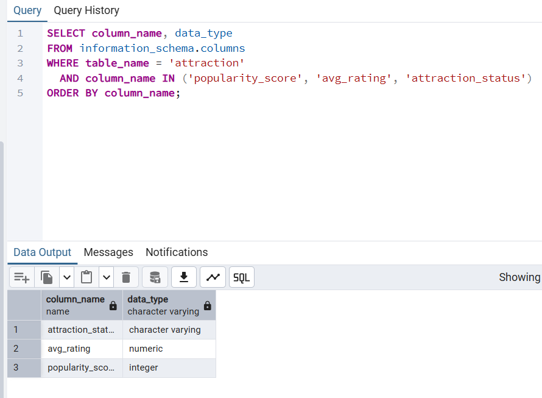


---


## Function 1 – fn_calculate_attraction_quality

### Description

This function receives an `attraction_id` and returns a numeric quality score for that attraction.

The score is composed of:
- The stored average rating scaled to 0–100 (main component)
- Ticket count bonus: up to 20 points
- Review count bonus: up to 15 points
- Cancelled ticket penalty: −2 per cancelled ticket
- Report penalty: −3 per report on the attraction's reviews

The score cannot go below zero. If the attraction does not exist, the function raises an exception with the message `Attraction with id X does not exist`.

**PL/pgSQL elements used:** `DECLARE`, variables, `IF / ELSIF`, `RAISE EXCEPTION`, `RAISE NOTICE`, `EXCEPTION WHEN OTHERS`.

### SQL Code

See [`StageD/Functions.sql`](StageD/Functions.sql) — `fn_calculate_attraction_quality`.

Example call:
```sql
SELECT fn_calculate_attraction_quality(1);
```

### Screenshot 2 – Function quality score

*Screenshot should be added here after calling the function in pgAdmin and verifying the returned score.*

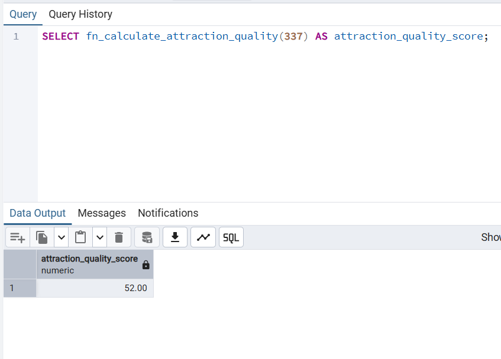


---


## Function 2 – fn_get_customer_activity_level

### Description

This function receives a `customer_id` and returns a string classification describing the customer's activity level in the system.

The classification is based on the number of tickets purchased, tickets used, tickets cancelled, reviews written, and reactions given.

Possible return values:

| Value | Meaning |
|-------|---------|
| `INACTIVE_CUSTOMER` | No tickets, reviews, or reactions |
| `RISKY_CUSTOMER` | Many cancellations exceeding used and active tickets combined |
| `VIP_CUSTOMER` | High ticket count, many used tickets, several reviews, many reactions |
| `ACTIVE_CUSTOMER` | Moderate engagement |
| `REGULAR_CUSTOMER` | Low but non-zero activity |

If the customer does not exist, the function raises an exception.

**PL/pgSQL elements used:** implicit cursor (`FOR ... IN SELECT ... LOOP`), `RECORD`, variables, `IF / ELSIF / ELSE`, `RAISE EXCEPTION`, `RAISE NOTICE`, `EXCEPTION WHEN OTHERS`.

### SQL Code

See [`StageD/Functions.sql`](StageD/Functions.sql) — `fn_get_customer_activity_level`.

Example call:
```sql
SELECT fn_get_customer_activity_level(1);
```

### Screenshot 3 – Function customer activity

*Screenshot should be added here after calling the function in pgAdmin and verifying the returned classification.*

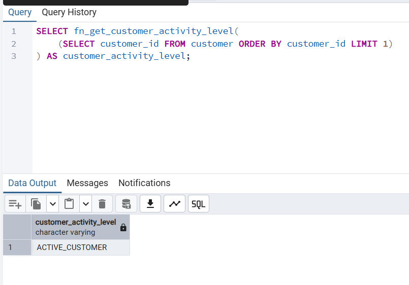


---


## Trigger 1 – trg_update_popularity_after_ticket_insert

### Description

This trigger fires automatically after every `INSERT` on the `ticket` table.

When a new ticket is inserted:
- If `ticket_status` is `active`, the `popularity_score` of the related attraction is incremented by 1.
- If `ticket_status` is `used`, the `popularity_score` is incremented by 2.
- Cancelled tickets do not change the score.

This trigger ensures that `popularity_score` stays up to date automatically without requiring manual updates after each ticket purchase.

**Trigger type:** `AFTER INSERT ON ticket`, `FOR EACH ROW`.

### SQL Code

See [`StageD/Triggers.sql`](StageD/Triggers.sql) — `trg_update_popularity_after_ticket_insert`.

### Screenshot 4 – Trigger popularity update

*Screenshot should be added here after inserting a ticket in pgAdmin and verifying that the related attraction's popularity_score was updated in the attraction table.*

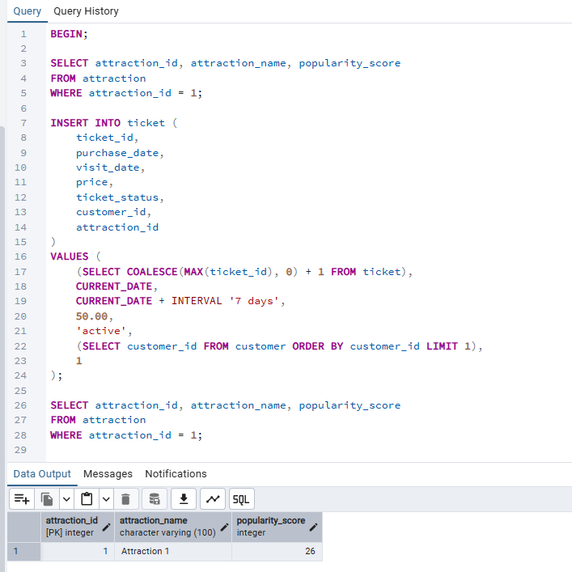


---


## Trigger 2 – trg_refresh_avg_rating_after_review_change

### Description

This trigger fires automatically after every `INSERT` or `UPDATE` of the `rating` or `is_deleted` columns on the `review` table.

When a review is inserted or its rating or deletion status changes, the trigger:
1. Finds the attraction linked to the review through its ticket (`review → ticket → attraction`).
2. Recalculates the average rating for that attraction from all active (non-deleted) reviews.
3. Updates the `avg_rating` column of the attraction.
4. Emits a `RAISE NOTICE` message with the updated attraction ID.

This trigger ensures that `avg_rating` in the attraction table is always consistent with the actual review data.

**Trigger type:** `AFTER INSERT OR UPDATE OF rating, is_deleted ON review`, `FOR EACH ROW`.

**Note:** The pgAdmin **Messages** tab will show a `NOTICE` line for each review change. The screenshot should preferably show this output.

### SQL Code

See [`StageD/Triggers.sql`](StageD/Triggers.sql) — `trg_refresh_avg_rating_after_review_change`.

### Screenshot 5 – Trigger avg_rating update

*Screenshot should be added here after inserting or updating a review in pgAdmin and verifying that the attraction's avg_rating was updated. The pgAdmin Messages tab should show the NOTICE output confirming the trigger ran.*

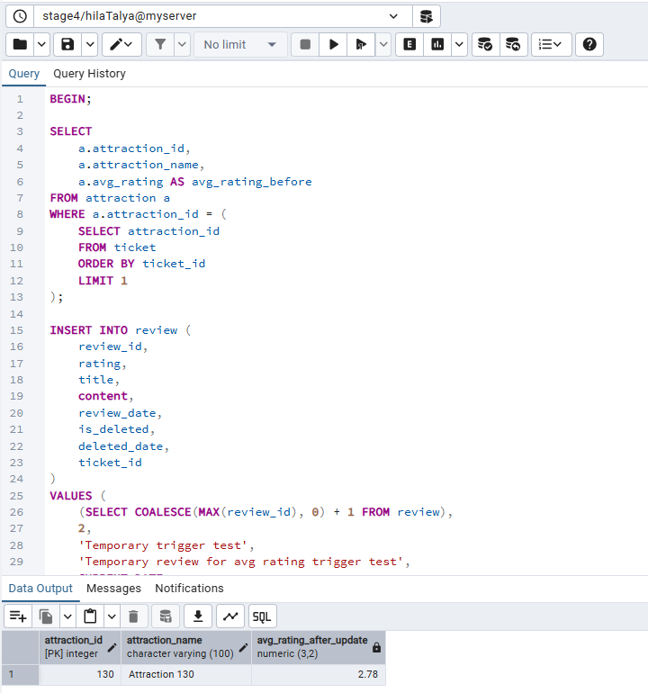


---


## Procedure 1 – pr_refresh_attraction_popularity

### Description

This procedure recalculates and updates the `popularity_score` for every attraction in the database in a single run.

For each attraction, the score is computed as:

```
popularity_score =
    GREATEST(
        active_tickets * 1
      + used_tickets   * 2
      + group_booking_tickets * 1
      - cancelled_tickets * 1,
      0
    )
```

The score cannot go below zero. Group booking tickets are counted from `booking_details` if that table exists; otherwise they are treated as zero.

The procedure emits a `RAISE NOTICE` for each attraction it updates.

**PL/pgSQL elements used:** explicit cursor (`CURSOR FOR`), `OPEN`, `FETCH`, `CLOSE`, `LOOP`, `EXIT WHEN NOT FOUND`, `DML UPDATE`, `RAISE NOTICE`, `EXCEPTION WHEN OTHERS`.

### SQL Code

See [`StageD/Procedures.sql`](StageD/Procedures.sql) — `pr_refresh_attraction_popularity`.

Example call:
```sql
CALL pr_refresh_attraction_popularity();
```

### Screenshot 6 – Procedure popularity update

*Screenshot should be added here after calling the procedure in pgAdmin and verifying the updated popularity_score values in the attraction table.*

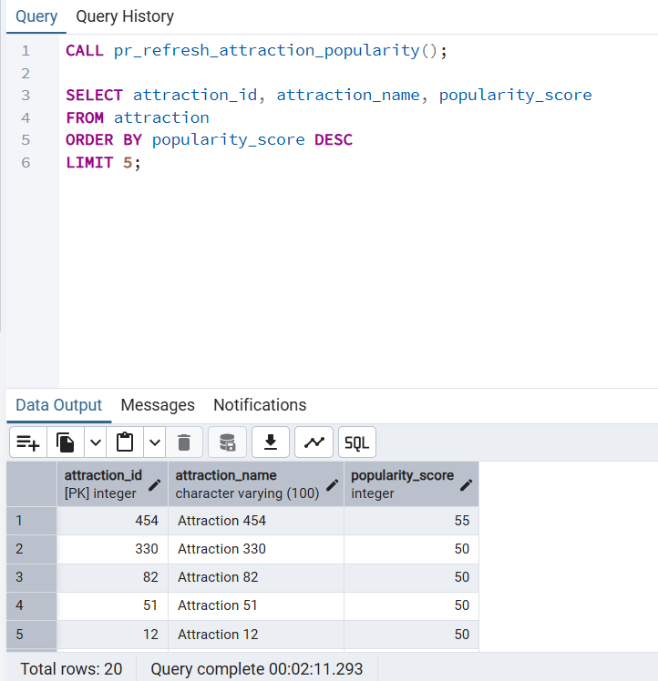


---


## Procedure 2 – pr_mark_problematic_attractions

### Description

This procedure evaluates every attraction and updates its `attraction_status` column based on business rules.

The status is assigned according to the following priority:

| Condition | Status assigned |
|-----------|----------------|
| ≥ 10 reports on reviews, or ≥ 20 cancelled tickets | `NEEDS_REVIEW` |
| ≥ 5 reviews and average rating < 3 | `LOW_RATED` |
| `popularity_score` ≥ 50 and average rating ≥ 3.5 | `POPULAR` |
| None of the above | `ACTIVE` |

Reviews are connected to attractions only through the path `review → ticket → attraction`. The procedure uses a `JOIN` through `ticket_id` to find reviews and reports for each attraction.

The procedure emits a `RAISE NOTICE` for each attraction it updates.

**PL/pgSQL elements used:** explicit cursor, `OPEN`, `FETCH`, `CLOSE`, `LOOP`, `EXIT WHEN NOT FOUND`, `DML UPDATE`, `RAISE NOTICE`, `EXCEPTION WHEN OTHERS`.

### SQL Code

See [`StageD/Procedures.sql`](StageD/Procedures.sql) — `pr_mark_problematic_attractions`.

Example call:
```sql
CALL pr_mark_problematic_attractions();
```

### Screenshot 7 – Procedure status update

*Screenshot should be added here after calling the procedure in pgAdmin and verifying the updated attraction_status values in the attraction table.*

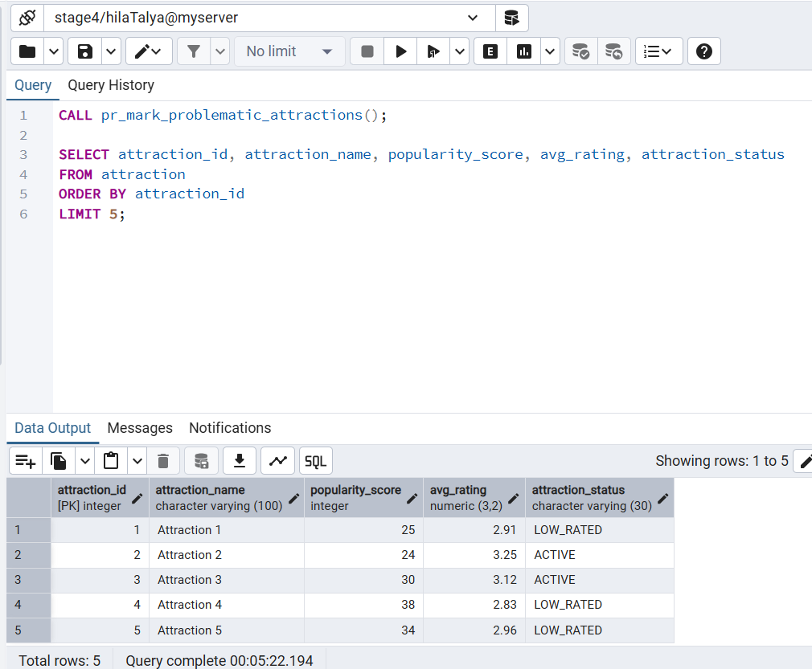


---


## Main Program 1

### Description

The first main program is a `DO` block that demonstrates a complete flow using Function 1 and Procedure 1.

Steps performed:
1. Calls `fn_calculate_attraction_quality` for attraction ID 337 and prints the quality score using `RAISE NOTICE`.
2. Calls `pr_refresh_attraction_popularity` to recalculate `popularity_score` for all attractions.
3. Handles unexpected errors using `EXCEPTION WHEN OTHERS`.

All output is visible in the pgAdmin **Messages** tab after execution.

### SQL Code

See [`StageD/MainPrograms.sql`](StageD/MainPrograms.sql) — Main Program 1.

```sql
DO $$
DECLARE
    v_attraction_id  INT     := 337;
    v_quality_score  NUMERIC;
BEGIN
    RAISE NOTICE '=== Main Program 1: Attraction Quality and Popularity Refresh ===';

    v_quality_score := fn_calculate_attraction_quality(v_attraction_id);
    RAISE NOTICE 'Quality score for attraction %: %', v_attraction_id, v_quality_score;

    RAISE NOTICE 'Calling pr_refresh_attraction_popularity for all attractions...';
    CALL pr_refresh_attraction_popularity();

    RAISE NOTICE '=== Main Program 1 completed successfully ===';
EXCEPTION
    WHEN OTHERS THEN
        RAISE NOTICE 'Error in Main Program 1: %', SQLERRM;
END;
$$;
```

### Screenshot 8 – Main Program 1 execution

*Screenshot should be added here after running Main Program 1 in pgAdmin. The Messages tab should show NOTICE output confirming that both fn_calculate_attraction_quality and pr_refresh_attraction_popularity were called.*

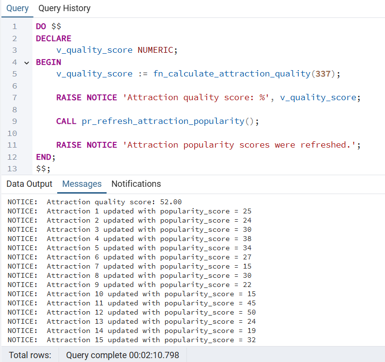


---


## Main Program 2

### Description

The second main program is a `DO` block that demonstrates a complete flow using Function 2 and Procedure 2.

Steps performed:
1. Calls `fn_get_customer_activity_level` for customer ID 1 and prints the classification using `RAISE NOTICE`.
2. Calls `pr_mark_problematic_attractions` to update `attraction_status` for all attractions.
3. Handles unexpected errors using `EXCEPTION WHEN OTHERS`.

All output is visible in the pgAdmin **Messages** tab after execution.

### SQL Code

See [`StageD/MainPrograms.sql`](StageD/MainPrograms.sql) — Main Program 2.

```sql
DO $$
DECLARE
    v_customer_id    INT         := 1;
    v_activity_level VARCHAR(30);
BEGIN
    RAISE NOTICE '=== Main Program 2: Customer Activity and Attraction Status Update ===';

    v_activity_level := fn_get_customer_activity_level(v_customer_id);
    RAISE NOTICE 'Activity level for customer %: %', v_customer_id, v_activity_level;

    RAISE NOTICE 'Calling pr_mark_problematic_attractions for all attractions...';
    CALL pr_mark_problematic_attractions();

    RAISE NOTICE '=== Main Program 2 completed successfully ===';
EXCEPTION
    WHEN OTHERS THEN
        RAISE NOTICE 'Error in Main Program 2: %', SQLERRM;
END;
$$;
```

### Screenshot 9 – Main Program 2 execution

*Screenshot should be added here after running Main Program 2 in pgAdmin. The Messages tab should show NOTICE output confirming that both fn_get_customer_activity_level and pr_mark_problematic_attractions were called.*

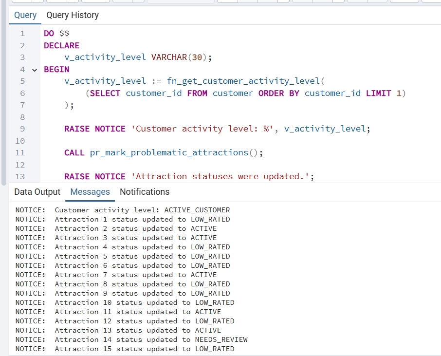


---


## Exception Handling Demonstration

### Description

Both functions include exception handling using `EXCEPTION WHEN OTHERS`. To demonstrate this, call `fn_calculate_attraction_quality` with an attraction ID that does not exist in the database.

The function will detect the missing attraction in its `IF NOT EXISTS` check, raise an exception with the message `Attraction with id X does not exist`, and then catch it in the `EXCEPTION WHEN OTHERS` handler, emitting a `RAISE NOTICE` and returning 0.

Example call:
```sql
SELECT fn_calculate_attraction_quality(-999);
```

The pgAdmin **Messages** tab will show the notice, and the query result will be `0`.

### Screenshot 10 – Exception handling

*Screenshot should be added here after calling the function with an invalid attraction_id in pgAdmin. The Messages tab should show the NOTICE output produced by the exception handler.*

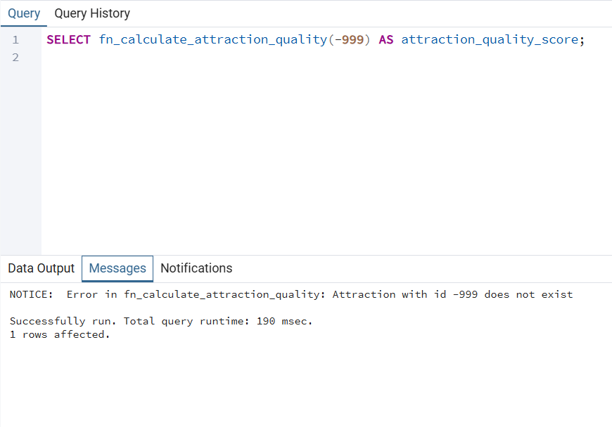


---


# Stage E - Graphical Application
(Submission Option 2)

This stage implements the complete Graphical User Interface (GUI) for the Attractions and Tourism Database. 

The application provides a seamless, user-friendly dashboard to interact with all database entities, perform CRUD operations, and execute analytical queries and procedures.

## Technologies Used
- **Python** & **Streamlit** for the dynamic, responsive frontend.
- **psycopg** for connecting to the PostgreSQL database.
- **Pandas** for rendering and manipulating tabular data.
- **Docker** for containerization and effortless deployment.

## Satisfying the Project Requirements

### 1. CRUD Operations Across Tables
The application supports **Create, Read, Update, and Delete** operations for all entities (Customers, Attractions, Tickets, Reviews, Moderation).
- **Read (SELECT)**: Interactive tables with search, sorting, and pagination.
- **Create (INSERT)**: Clean forms that validate user input before writing to the database.
- **Update (UPDATE)**: When updating, the user selects the primary key (or name), and the system automatically brings in all the other fields.
- **Delete (DELETE)**: Dedicated buttons to safely remove records, including soft-delete functionality for sensitive entities like Reviews.

### 2. User-Friendly Data (No Raw IDs)
The interface was specifically designed so that **users never have to deal with raw database IDs**.
- By utilizing Foreign Keys (JOINs), the interface replaces IDs with meaningful data.
- For example, instead of choosing \category_id = 5\, the user selects \Water Parks\ from a dropdown. 
- The same applies to Tickets, Attractions, and Customer names. 

### 3. Executing Queries & Procedures
A dedicated **Database Programs** screen allows the execution of complex SQL from previous stages:
- **Queries from Stage B**: Integrated into the *Analytics & Reports* tab (e.g., Top Attractions, Booking Summaries).
- **Functions & Procedures from Stage D**: The app can calculate an Attraction's Quality Score, get a Customer's Activity Level, and run procedures to refresh popularities directly via button clicks.

---

## Application Screenshots

All screenshots of the application execution are stored in the \StageE/screenshots\ folder. Below is a detailed view of each screen:

### 1. Main Dashboard
The central hub for navigation, providing a quick overview of system statistics and easy access to all modules.
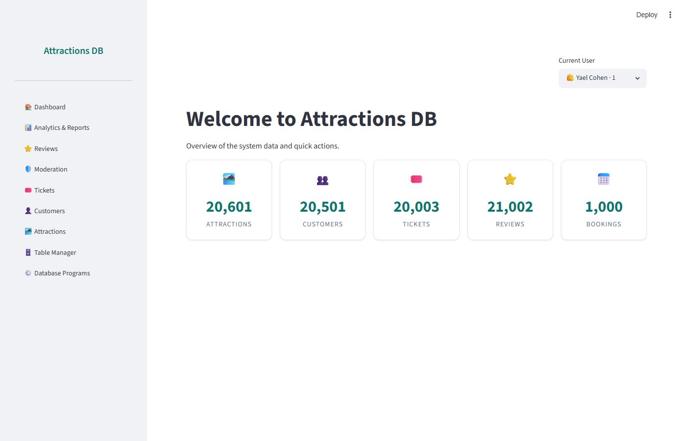

### 2. Attractions
Dynamic data tables displaying all attractions. Includes functionality to view details with ID-to-Name resolution, and to Add, Edit, or Delete attractions directly from the UI.
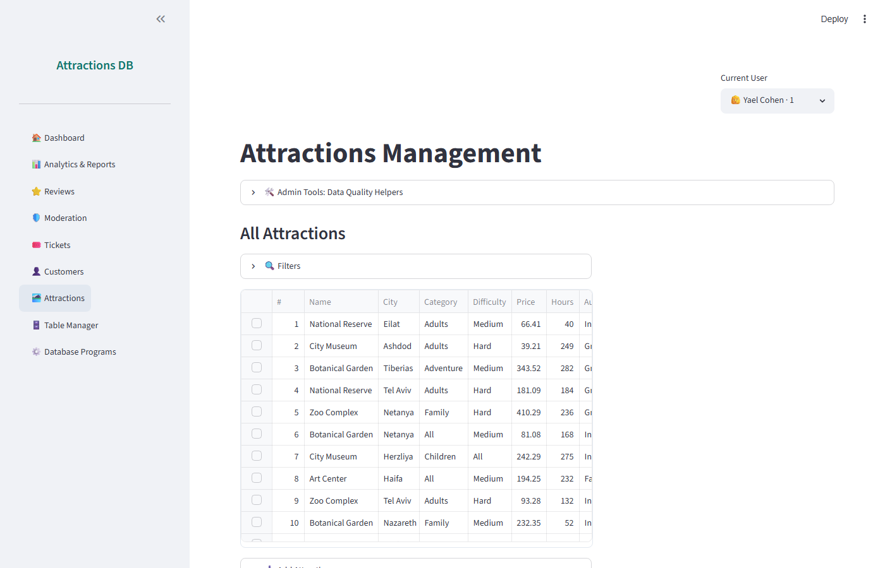

### 3. Tickets
Managing the tickets inventory. Allows users to view ticket types, pricing, and associate them with specific attractions effortlessly.
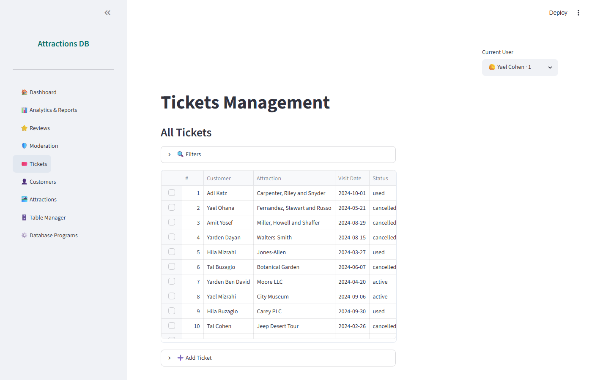

### 4. Moderation
Dedicated screen for system moderation and administrative tasks to manage reported content and system health.
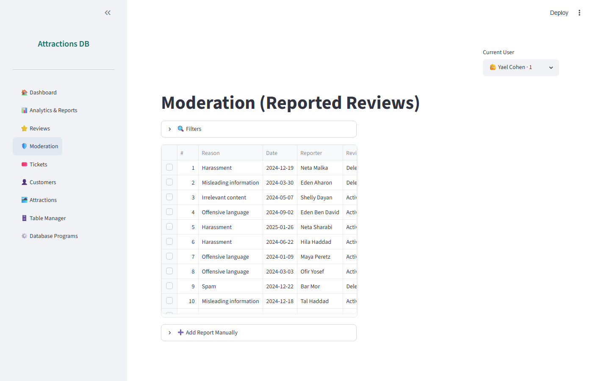

### 5. Customers
Comprehensive view of all registered customers in the system, displaying contact information and user details.
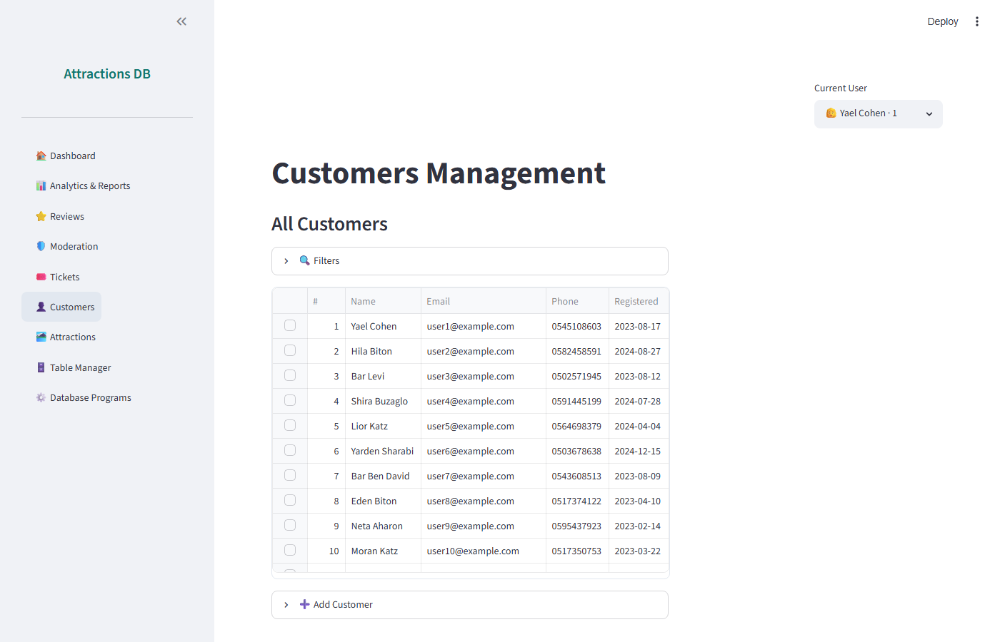

### 6. Reviews
A complete interface to manage and read customer reviews for attractions, including moderation status and star ratings.
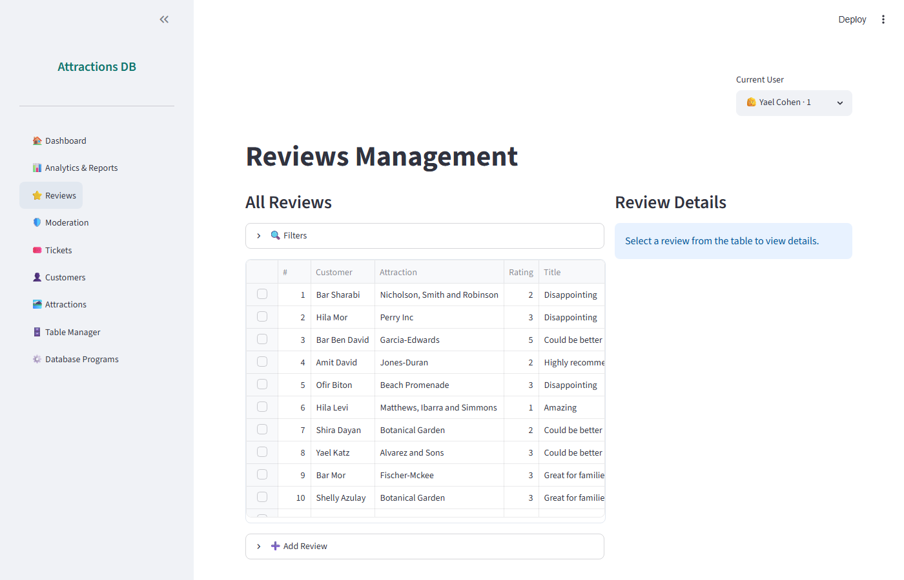

### 7. Analytics & Reports
Executing Stage B queries for advanced data analysis. Features detailed reporting on top attractions, booking summaries, and revenue metrics.
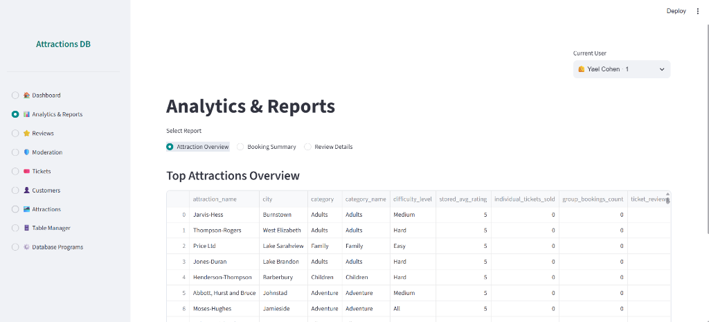

### 8. Database Programs
Running Stage D programs with user feedback. Allows executing stored procedures and functions (like calculating quality scores or updating popularity) with a single click.
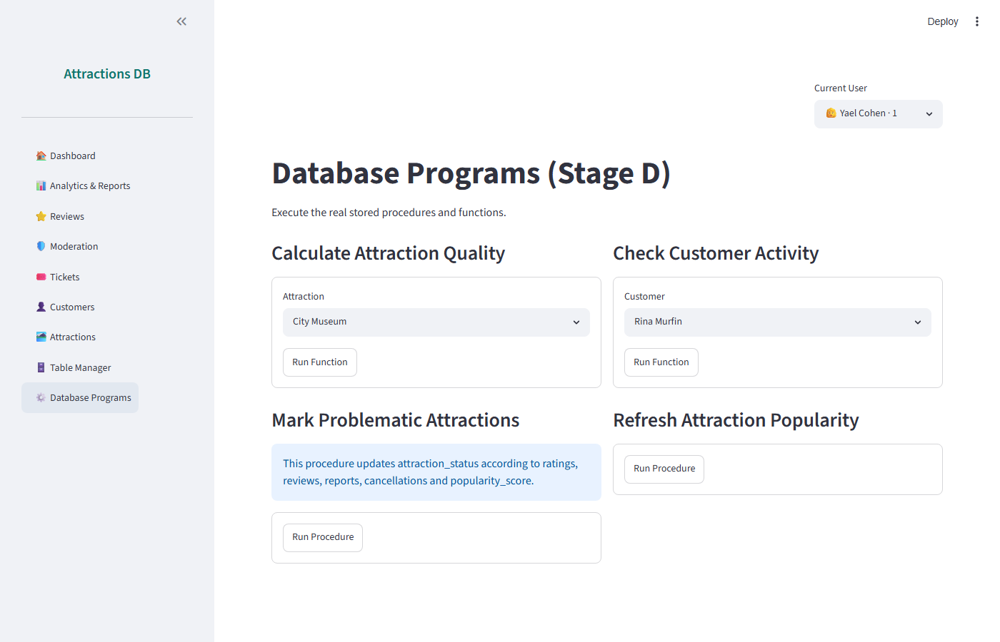

### 9. Table Manager (Admin)
Direct access to raw table data with advanced filtering for database administrators.
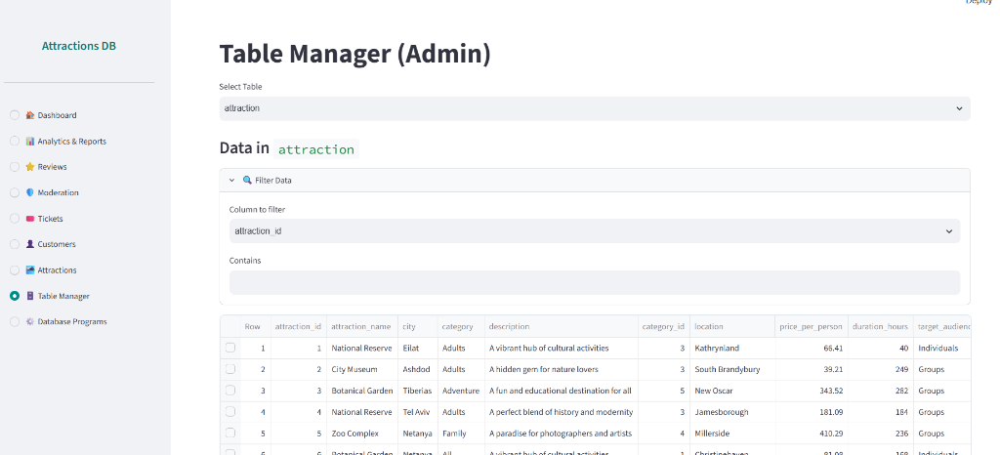

---

## How to Run the Application (Submission Option 2)

This project is packaged with Docker, meaning the database and the Streamlit Web App can be run together with a single command. **You do not need to install Python, Streamlit, or PostgreSQL on your host machine.**

1. **Prerequisites**: Ensure you have [Docker Desktop](https://www.docker.com/products/docker-desktop/) installed and running on your computer.
2. **Clone or Download**: Clone this repository or extract the ZIP file to your computer.
3. **Run the Project**: Open a terminal (Command Prompt, PowerShell, or macOS Terminal), navigate to the root directory of the project (where `docker-compose.yml` is located), and run the following command:
   ```bash
   docker-compose up --build -d
   ```
4. **Wait for Initialization**: The PostgreSQL database will automatically initialize using the provided `init-db/01-init.sql` dump file containing all the schema, data, views, functions, and procedures. The Streamlit app will wait for the DB to be healthy before starting.
5. **Open the Application**: Open your web browser and go to:
   👉 **[http://localhost:8501](http://localhost:8501)**

### Optional: pgAdmin Database Access
If you wish to inspect the database directly using pgAdmin:
1. Open your web browser and go to: **[http://localhost:8080](http://localhost:8080)**
2. **Login Details**:
   - Email: `hchaimov@g.jct.ac.il`
   - Password: `hilaTalya`
3. The database server is already connected. Expand the Servers tree and look for the `integrateDB` database.

---

# Summary

This project presents a database for an **Attractions and Tourism** system with a focus on a **Review System**.

The database was designed based on AI-generated screens and includes the main entities required for storing customers, attractions, tickets, reviews, reactions, and reports.

In Stage A, we designed the database schema, created the ERD and DSD diagrams, inserted data using three methods, and performed backup and restore.

In Stage B, we wrote complex SQL queries, including paired queries written in different ways, update and delete operations, constraints, transaction demonstrations using `ROLLBACK` and `COMMIT`, and indexes with performance comparison.

In Stage C, we performed integration with the database of another team (outerDB — a booking system). We applied reverse engineering to reconstruct the ERD of the received system, designed a combined ERD, and implemented the integration using `ALTER TABLE` and `CREATE TABLE` commands. We created a new integrated database (`dbintegrated`) containing data from both systems, and wrote three views with two queries each.

In Stage D, we extended the integrated database with PL/pgSQL programming. We added new columns to the `attraction` table (`popularity_score`, `avg_rating`, `attraction_status`), implemented two functions, two procedures, and two triggers, and wrote two main programs that call the functions and procedures and demonstrate the complete flow.

The project now includes:
- system definition
- AI Studio link
- ERD and DSD diagrams
- design decisions
- data insertion methods
- backup and restore documentation
- Stage B SQL queries, constraints, indexes, and transaction demonstrations
- Stage C integration (reverse engineering, combined ERD, integration SQL, views and queries)
- Stage D PL/pgSQL functions, procedures, triggers, and main programs
- Stage E Graphical Interface Application (GUI)

---
